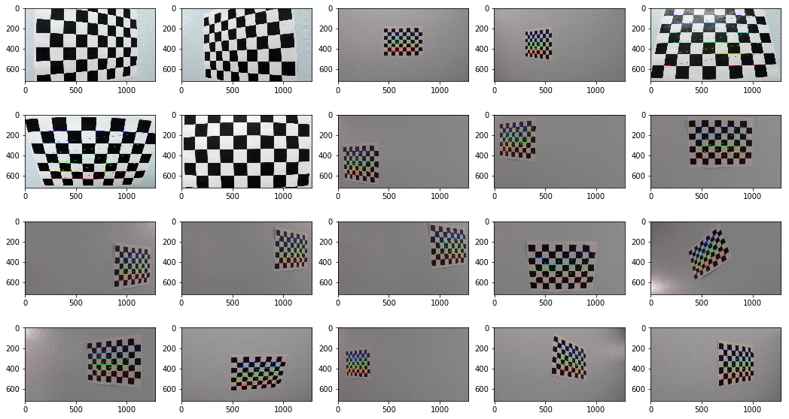
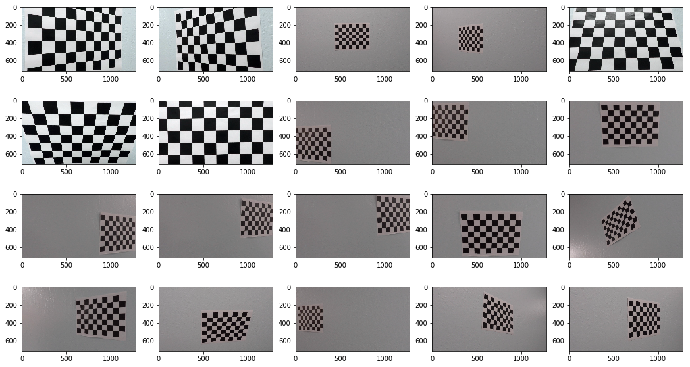
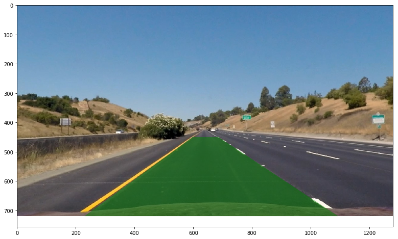
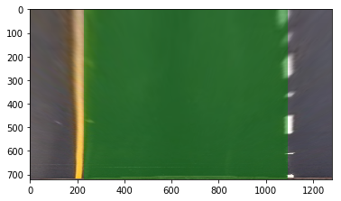
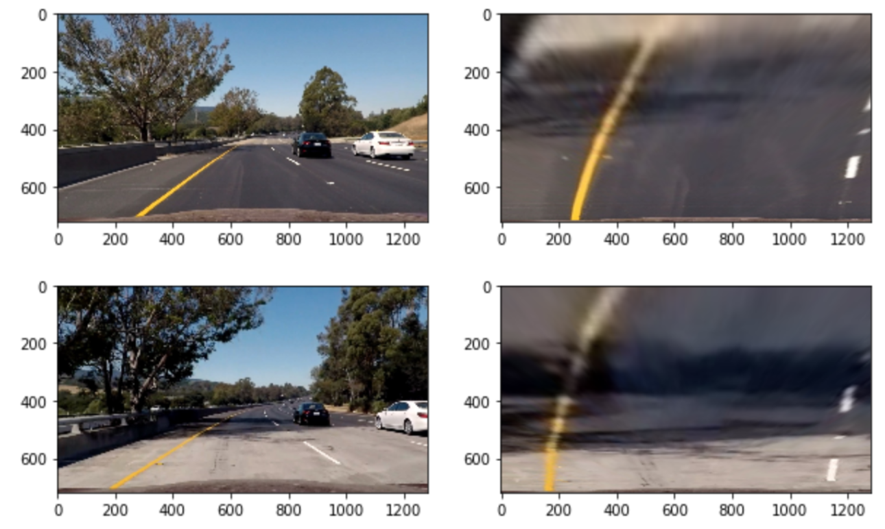
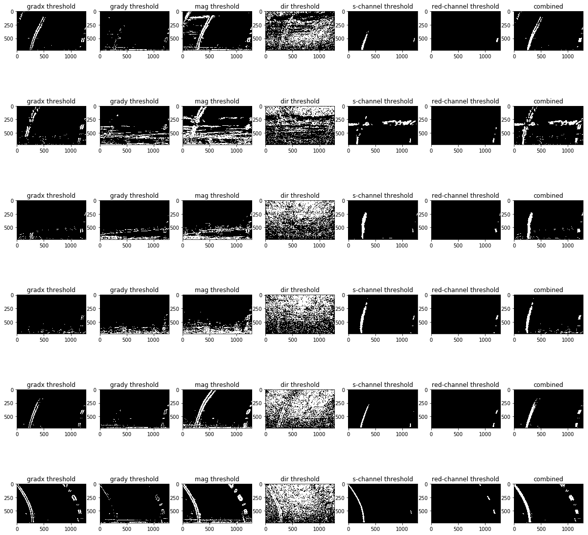
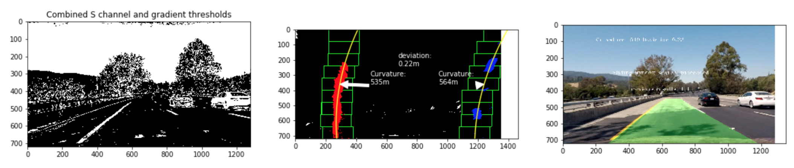
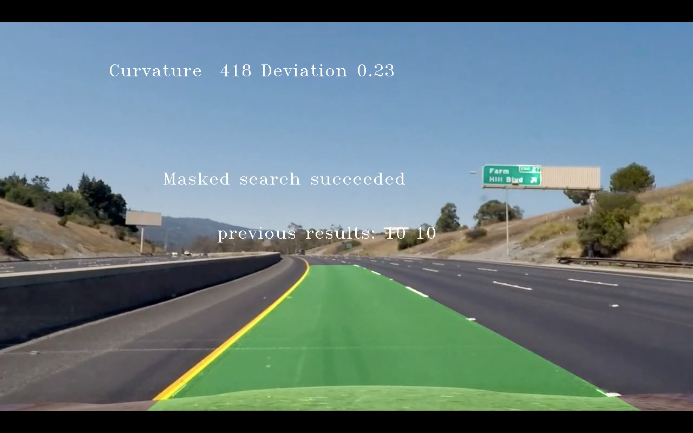
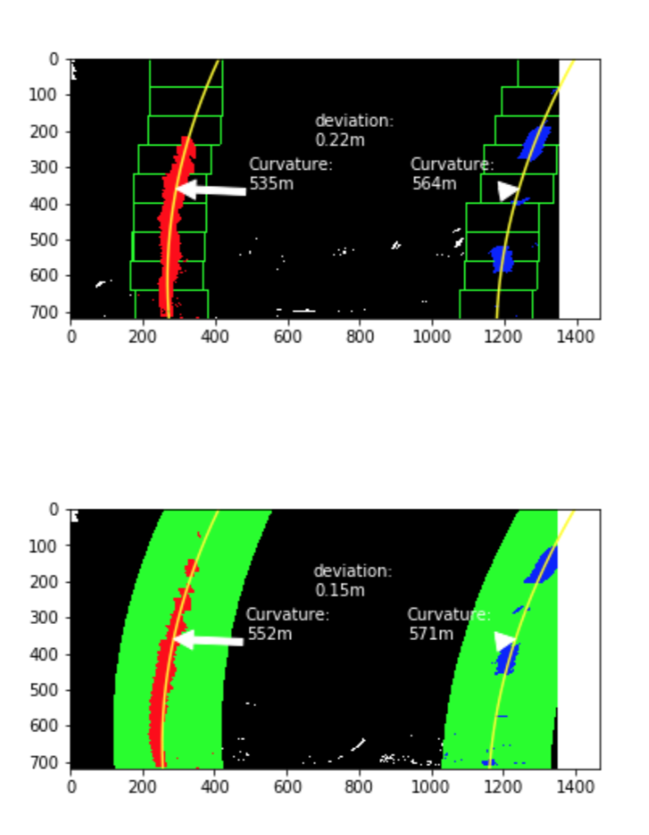
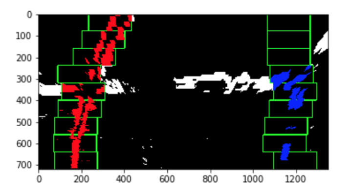

# Advanced Lane Finding Project

The goals / steps of this project are the following:

* Compute the camera calibration matrix and distortion coefficients given a set of chessboard images.
* Apply a distortion correction to raw images.
* Use color transforms, gradients, etc., to create a thresholded binary image.
* Apply a perspective transform to rectify binary image ("birds-eye view").
* Detect lane pixels and fit to find the lane boundary.
* Determine the curvature of the lane and vehicle position with respect to center.
* Warp the detected lane boundaries back onto the original image.
* Output visual display of the lane boundaries and numerical estimation of lane curvature and vehicle position.

## Camera Calibration

#### 1. Briefly state how you computed the camera matrix and distortion coefficients. Provide an example of a distortion corrected calibration image.

A list of images taken of a chessboard image by the camera used in the car is provided. The corners in the chessboard is detected and their coordinates mapped to the known real world coordinates of the chessboard. We know the real world coordinates of a chessboard are on a plane and on a rectangular grid hence it is easily generated. A transformation matrix can then be obtained. The key functions used are `cv2.findChessboardCorners` and `cv2.calibrateCamera`. Here are the chessboard images before and after calibration:

Before:


After:


You can see the transformation undistorted the image such that the lines on the chessboard are now straight.

## Pipeline

### Perspective Transform

The camera image is transformed such that you get a top down view of the road. This will make subsequent processing a lot easier. To obtain the transformation matrix, a trapezoid is picked on a test image where the lane lines are parallel. The Trapezoid covers the lane area of the road we want to detect. This trapezoid is mapped into a rectangle and the transform matrix obtained using function `cv2.getPerspectiveTransform`. Here are the images before and post perspective transform.

Before Transform


After Transform


It can be seen that in the second image, the lane lines appears vertical and parallel indicating the transform is correct. The function for perform the transform `cv2.warpPerspective` also does a crop which I defined to exclude most of the area of the image we are not interested in.

Applying transform to test images:


### Colour and gradient based filtering

There are 6 methods I tried to filter images: Gradient in X direction, Gradient in Y direction, Gradient Magnitude, Direction of Gradient, S colour channel and R colour channel. The result of these threshold on a set of test images can be seen below:



Of all the methods, "Gradient in X direction" works well until there is large variation of light in the image. S channel was able to pick out the lines in most test images but also picked up the highlight in the road in test image 2. The r channel is very good at identifying the white dashed line. Hence the final filtering algorithm divised is `(gradx == 1) | (s_binary == 1) | (r_binary == 1)`.

### Sliding Window Search and polynomial fitting

The filtering left us with the pixels likely to correspond to left and right lane lines. We need to identify exactly the pixels in the lane lines exactly. To do this a sliding window search is used. Starting from bottom of the image, successive boxes of 80px x 200px are places on top of each other to identify where the lane line is. The x position of the boxes are moved according to the x positions of the pixels identified inside the box. To identify a starting position for the first box, a histogram is constructed for the bottom half of the image. The two top peaks of the histogram are taken as the starting location for the two lane lines.



All the pixels after filtering that fall inside the boxes are collected and a polynomial curve is fitted to these points using the `np.polyfit` function. This parametric curve is plotted in the above image.

### Radius of Curvature and Vehicle Positioning

Once we have the second order polynomial, it is easy to calculate the curvature anywhere along the line. We use the following formulae:

```
f(y) = Ay^2 + By + C
R_curve = (1 + (2Ay + B)^2)^(3/2)/|2A|
```
In the above image the curvatures are calculated at where the arrows are pointing and printed on the image.

When I did the perspective transformation I measured the width of the lane to be 863 pixels. According to road regulations, the lanes should be 3.7 meters. Hence we can transform any pixel distance to meters using 3.7/863 meters per pixel. We can find the lane location in pixel by evaluating the polynomials of the left and right lines at the bottom of the image. We can then calculate the middle of the lane by using `x_middle = (x_left+x_right)/2`. Assume the centre of the car is at the centre of the image, We then obtain the distance the car is off centre using `x_middle - image_width/2`. We finally calculate the distance in meters from the pixel distance. You can see the distance also printed in text in the above image.

### Mapping Lane Area Back to Camera Image

I evaluate a few points on the fitted lane lines so that a polygon can be drawn to cover the lane areas. The lines are fitted in the transformed perspective. Hence the coordinates of the points need to be transformed back into the camera perspective. This is done by warping using the inverse perspective matrix. The inverse matrix can be obtain by calling `np.linalg.inv`. Example of the final mapped lane area can be seen below:



### Masked Search - Avoiding Sliding Window Search on every frame

If we have identified lane lines in a previous frame we can assume that we will find the lane line in a similar areas in the next frame. Hence we do not need to do a Sliding window search all over again, we can simply filter the points in a general area around the lane lines found in the previous frame. Below is an illustration of the area:



The first image is sliding window search. The result is stored. When it comes to analysing the second image, because there is prior knowledge about the lane lines, the algorithm automatically uses a simple mask around the previously detected lines and fit the polynomials directly on the masked pixels. In the above image, the green area is the mask and the red/blue pixels are the masked pixels. This speeds up detection a lot. Masking operations are particularly fast on GPUs.

### Sanity check

Even the sliding window search is not 100% reliable. It fails on the following image for example:



Hence we need some sort of sanity check on each image to reject bad lines. I devised the following criteria:
1. Checking they have curvature larger than the minimum regulations - The [us regulations](http://onlinemanuals.txdot.gov/txdotmanuals/rdw/horizontal_alignment.htm#BGBHGEGC) states the minimum curvature of a road to be 196m.
1. Checking that they are roughly parallel - I evaluate 50 points on the lane lines and calculate 50 pixel distances in the x direction. I mandate that the standard deviation of these 50 values cannot be more than 5% of the mean.
1. Checking the lines are separated by roughly right distance - The mean distance of the 50 values I calculated before cannot deviate more than 10% from the 3.7 m standard lane width value.

My implementation is written such that the masked search will be attempted first if sanity check fails or if there is simply no previous history to draw the mask from then sliding window search will be performed. If even sliding window search fails, the algorithm rely on historical data and produce a guess of the lane line. It always remembers the lane lines detected from the 10 most recent frames and presents the average of the 10 as the best fit. This way the final video will be more smooth and we can tolerate a few frames where the algorithm simply cannot find lane lines.

## Video Result

<video width="960" height="540" controls>
  <source src="test_videos_output/project_video.mp4">
</video>

## Discussion

#### 1. Briefly discuss any problems / issues you faced in your implementation of this project.  Where will your pipeline likely fail?  What could you do to make it more robust?

1. The colour/gradient filtering is not particularly successful. If the road is light in colour then there is a lot of noise. Different filtering techniques work best under different conditions, hence maybe we can dynamically change the filter if we detect different surface or lighting condition. I think we might be able to more aggressively cull pixels based on their location in the image.
1. Sliding window search is not particularly robust. I have shown above an example where it did not work. Especially on the right lane line where pixels are more sparse and in patches. A more sophisticated method might be needed.
1. The perspective transformation is not very accurate especially if vehicle yaw/pitch against the road. It would be great if there are extra sensors to calibrate the transform in real time.
